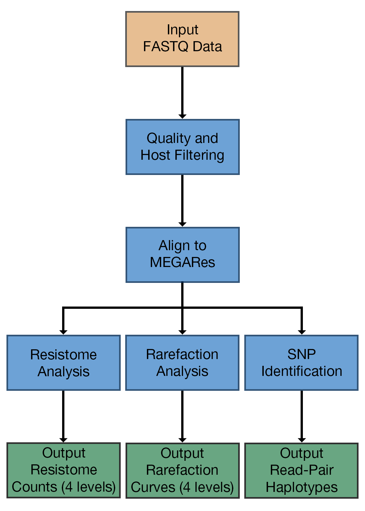

# AmrPlusPlus is an Easy to Use App that Identifies and Characterizes Resistance Genes within Sequence Data

AmrPlusPlus is a Galaxy-based metagenomics pipeline that is intuitive and easy to use. The pipeline takes advantage of current and new tools to help identify and characterize resistance genes within metagenomic sequence data.

The pipeline can be used under a local instance of Galaxy ^1,2,3^ and installed via Galaxy's Main Tool Shed. It is also available as a Galaxy-based Docker Image, using base images developed by Björn Grüning at the University of Freiburg.

We recommend checking out his [Github repository](https://github.com/bgruening/docker-galaxy-stable "GitHub is a web-based Git repository hosting service. It offers all of the distributed version control and source code management (SCM) functionality of Git as well as adding its own features."). for other Galaxy tools and workflows.

---

## What's Included in the Installation?

AmrPlusPlus consist of:

* [Trimmomatic](http://www.usadellab.org/cms/?page=trimmomatic)^4^ (for removal of low quality bases and sequences),
* [BWA](http://bio-bwa.sourceforge.net/)^5^ (for detection of host DNA and resistance genes),
* [Samtools](http://www.htslib.org/)^6^ (for removal of host DNA),
* [SNPFinder](https://github.com/cdeanj/snipfinder) (for detection of haplotypes),
* [ResistomeAnalyzer](https://github.com/cdeanj/resistomeanalyzer) (for resistome analysis).
* [RarefactionAnalyzer](https://github.com/cdeanj/rarefactionanalyzer) (for rarefaction analysis)

Together, these tools make up the entire AmrPlusPlus pipeline. Only three inputs are required to run the pipeline: a single or paired fastq dataset, a resistance database (fasta), and a host genome (fasta).

---

## What is the goal of AmrPlusPlus?

The goal of many metagenomics studies is to characterize the content and relative abundance of sequences of interest from the DNA of a given sample or set of samples. You may want to know what is contained within your sample or how abundant a given sequence is relative to another.

Often, metagenomics is performed when the answer to these questions must be obtained for a large number of targets where techniques like multiplex PCR and other targeted methods would be too cumbersome to perform. AmrPlusPlus can process the raw data from the sequencer, identify the fragments of DNA, and count them. It also provides a count of the polymorphisms that occur in each DNA fragment with respect to the reference database.

Additionally, you may want to know if the depth of your sequencing (how many reads you obtain that are on target) is high enough to identify rare organisms (organisms with low abundance relative to others) in your population. This is referred to as rarefaction and is calculated by randomly subsampling your sequence data at intervals between 0% and 100% in order to determine how many targets are found at each depth. AmrPlusPlus can perform this analysis as well.

As a result of AmrPlusPlus, you will obtain count files for each sample that can be combined into a count matrix and analyzed using any statistical and mathematical techniques that can operate on a matrix of observations.

For an example of a study where we have performed this using metagenomic sequencing data, you can read the open access [manuscript](https://www.ncbi.nlm.nih.gov/pmc/articles/PMC4798965/) entitled “Resistome diversity in cattle and the environment decreases during beef production”.

<figure markdown>
  { width="450" }
  <figcaption></figcaption>
</figure>

*[Galaxy-based metagenomics pipeline]: The Galaxy Project: Online bioinformatics analysis for everyone. Galaxy. Data intensive biology for everyone. Galaxy is an open, web-based platform for data intensive biomedical research. Whether on the free public server or your own instance, you can perform, reproduce, and share complete analyses.
