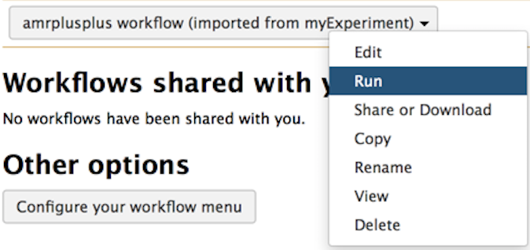
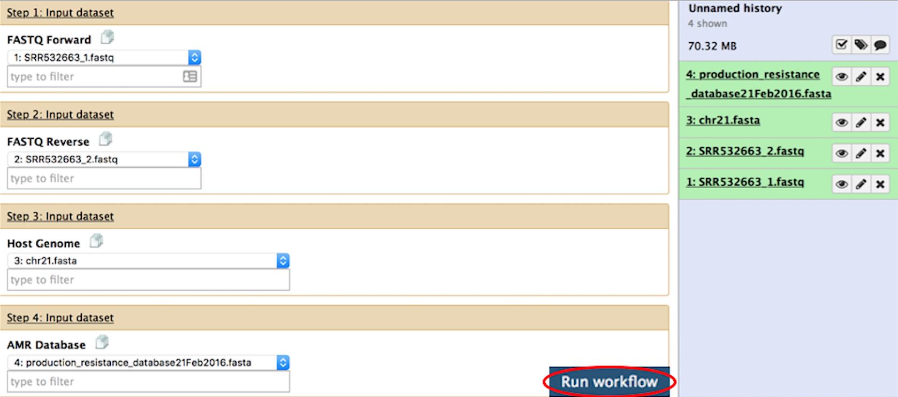
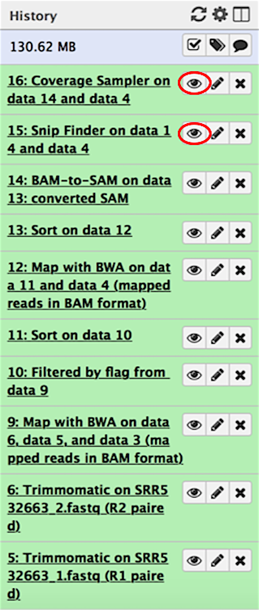
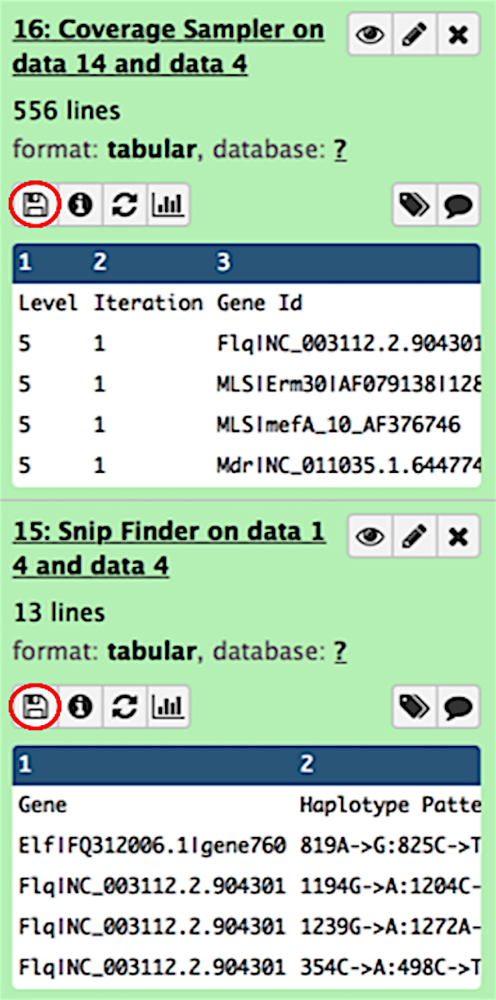

# Run AMR++ Workflow
Now that we've got our data uploaded to our Galaxy server, it's time to run the workflow.

??? example "Step 1: Navigate to the Workflow Tab"
    ### Navigate to the Workflow Tab
    
    See the workflow tab circled in red below on the Galaxy homepage:

    

    Then click on the workflow you imported earlier and select **Run**
    
    { width="350" }

    You will be redirected to a page (see below) displaying each component of the workflow.
    
??? example "Step 2: Select the Datasets"
    ### Select the Datasets
    
    First, select the forward read pair. Then, select the second read pair. Next, select the host genome and resistance database. If you wish to customize any of the workflow components, please see the [Workflow Parameters](../documentation/usermanual.md) section before proceeding.

    Once the datasets have been selected, simply click the **Run workflow** button (circled in red).

    

??? example "Step 3: View the Outputs"
    ### View the Outputs
    
    When the workflow completes, you can find all intermediate and final outputs in the Galaxy history pane. The outputs you will be most interested in come from the SNPFinder and CoverageSampler modules. To view the outputs, simply click on the view data icon (circled in red).

    Once the datasets have been selected, simply click the Run workflow button (circled in red).

    { width="300" }
    
    These outputs can then be downloaded to your local machine by clicking on the download icon (circled in red). For more information on interpreting the output from each of these tools, please see the [CoverageSampler](../documentation/pipeline.md) and [SNPFinder](../documentation/pipeline.md) output descriptions.

    { width="300" }

