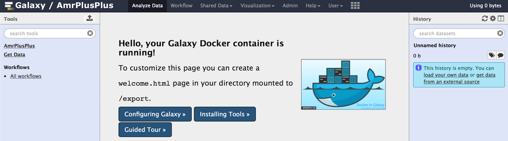
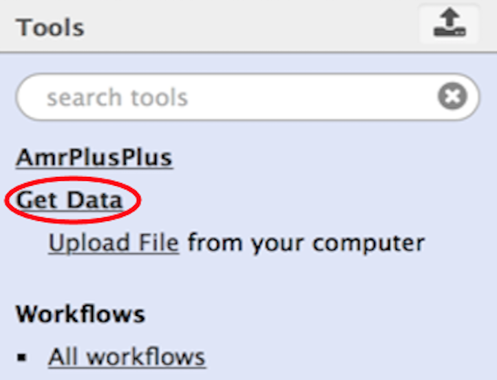
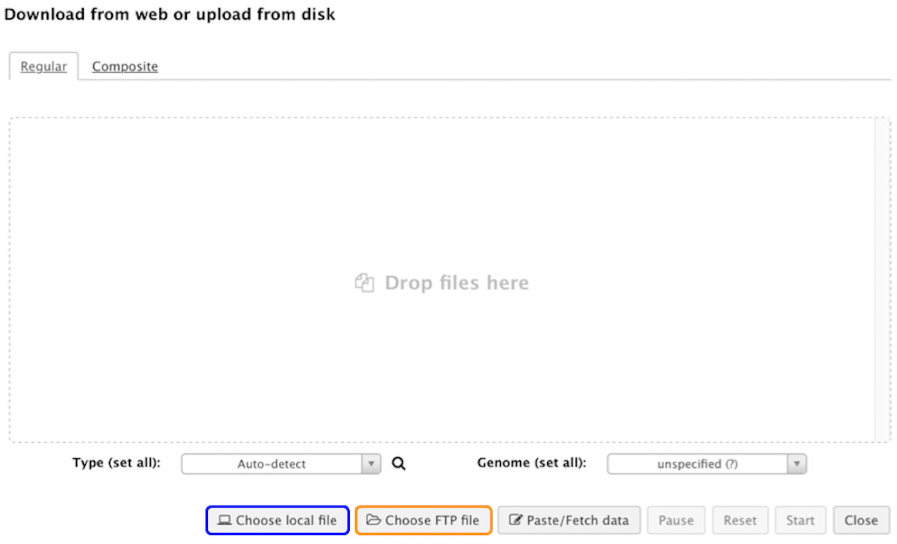
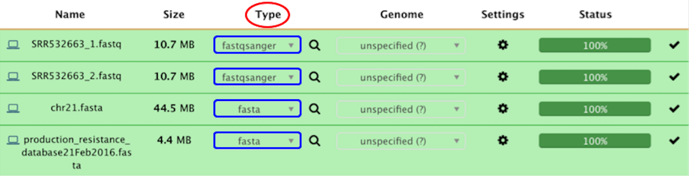
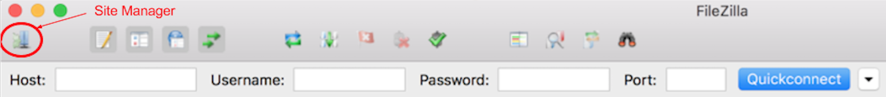
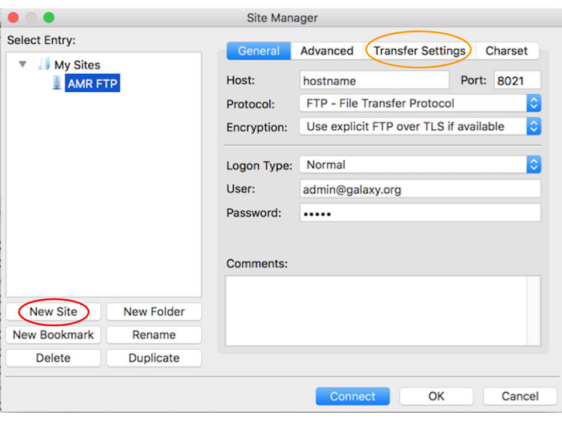
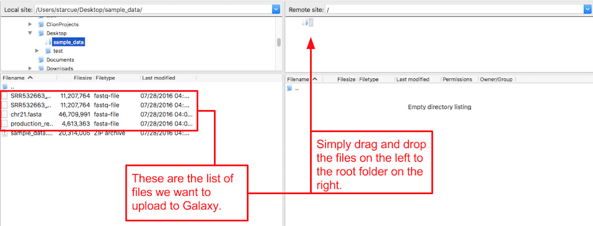
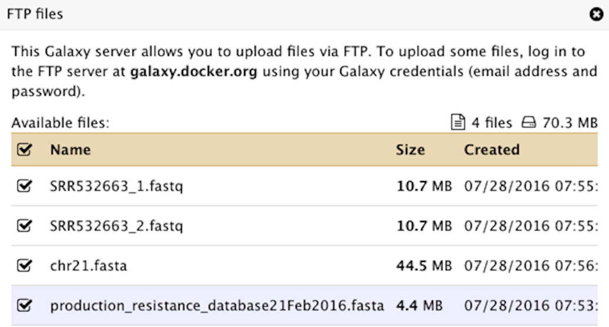

# Upload Data into AMR++

## Tutorial Data

In the Use [Tutorial Data section](#tutorial-data), we upload a sample data set using the **Get Data** module. This section is for those who are new to Galaxy and who want to get more comfortable with the Galaxy interface.

## Upload Your Data

In the [Upload My Own Data](#upload-your-data) section, we use [FileZilla](https://filezilla-project.org/ "FileZilla is a powerful, free file management tool for FTP access to your Web site's server.") to upload data via FTP. This section is for those who have large data sets (>2 GB) that they want to upload and run.

??? example "Use Tutorial Data"
    #### New to Galaxy?
    This section should get you up to speed with Galaxy and how to upload data.

    ### Step 1
    
    #### Download Sample Data
    
    Let's get some sample data. Download the [example data](https://megares.meglab.org/amrplusplus/latest/html/_data/sample_data.zip). The example data in this tutorial was taken from the full dataset of the [human genome (hg38)](http://hgdownload.cse.ucsc.edu/downloads.html#human), along with a paired metagenome [sample (SRR532663)](http://www.ncbi.nlm.nih.gov/sra/?term=SRR532663) from the Human Microbiome Project (HMP) on NCBI.

    Once downloaded, unzip the sample_data.zip archive. You should see four files:

    - SRR532663_1.fastq
    - SRR532663_2.fastq
    - production_resistance_database.fasta
    -  chr21.fasta

    ---

    ### Step 2
    
    #### Upload Data
    
    There are a couple ways that we can upload these files to Galaxy:

    1. Via the Galaxy **Get Data** module
    1. Via a **file transfer protocol** (FTP)

    !!! info "Note"
        Currently, the Geta Data module only supports file uploads that ```are less than 2GB```. If you wish to upload files larger than 2GB, you will need some FTP software such as [FileZilla](https://filezilla-project.org/ "FileZilla is a powerful, free file management tool for FTP access to your Web site's server."), however, it is not required for the sample data provided in this tutorial.

    Let's upload our data to Galaxy. First, make sure that your Galaxy server is running. Right now, you should be staring at a page similar to the following:

    

    Click on the **Get Data** link circled in red, and navigate to the underlined **Upload File** link.

    { width="300" }

    From here, we are given the options of **Choosing a local file** (highlighted in blue) or **Choosing an FTP file** (highlighted in orange). Let's choose a local file since our data is less than 2GB. If you want to upload via FTP, see the [Upload My Own Data](#upload-your-data) section.

    

    Navigate to the folder where you extracted the sample data, select the appropriate datasets, and upload them.
    
    Once selected, navigate to the **Type** column (circled in red) and specify the file type (highlighted in blue) for each dataset from the drop down menu. For each fastq dataset, select the **fastqsanger** option, and for each **fasta** dataset, select the fasta option. Next, click the **Start** button to begin uploading the data to your Galaxy server.

    If everything goes well, you should see all green. That's good! You can find the uploaded datasets in the right hand side of the Galaxy homepage. Now, let's head over to the [Run Workflow](../running/runworkflow.md) section to run the pipeline.

    


\- OR -

??? example "Upload Your Own Data"
    
    #### Using FTP to Manage Your Data
    In this section, we'll cover what you need to know to upload your own data via FTP.

    If you haven't already done so, head on over to [FileZilla](https://filezilla-project.org/ "FileZilla is a powerful, free file management tool for FTP access to your Web site's server.") and download their FTP client. It's free and very easy to use.

    ### Step 1
    #### Enter FTP Credentials
    
    Connecting to your FTP server is really easy. Navigate to the site manager (circled in red):

    

    Click on the **New Site** button (circled in red) and enter a name for your FTP connection. Next, click on the **Transfer Settings** button (circled in orange) and check the **Active** radio button under **Transfer mode**. Go back to the **General** tab and enter in your credentials; replacing the **hostname** with your own. Under **User**, enter in **admin@galaxy.org** and under **Password** enter **admin**.

    

    ---

    ### Step 2
    #### Transfer Files
    Once connected, we can upload some files. On my machine, I have files on my Desktop under a directory called sample data (highlighted in blue). Navigate to the folder where your data is. You will see a list of files in that directory through the FTP client interface (highlighted in red). Simply drag and drop the desired files to the root directory as illustrated below.

    

    ---

    ### Step 3
    #### Upload FTP Files
    
    Once the transfer has completed, navigate to the **Get Data** module on your Galaxy homepage and select the **Upload File** link.

    { width="300" }

    Next, click on the Choose FTP file option.

    

    Check all the boxes for each dataset.

    

    Next, find the **Type** tab in the next window and specify the file type for each file from the drop down menu. Choose **fastq sanger** for your fastq datasets and **fasta** for your fasta datasets. That's it! You should then see the files loading in your **History** pane on the Galaxy homepage. Now, let's head over to the [Run Workflow](runworkflow.md) section to run the pipeline.

    
    
    !!! info "Note"
        You may need to refresh the history pane to see the uploaded datasets, which you can do by clicking on the **Refresh history** :material-sync: icon directly to the right of the history pane.