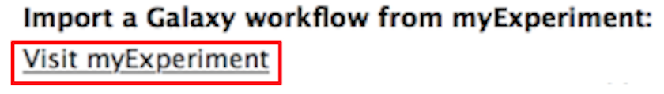
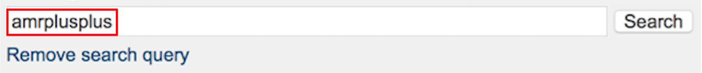
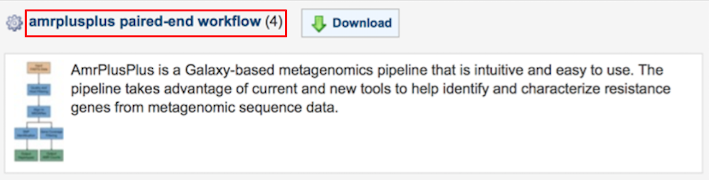
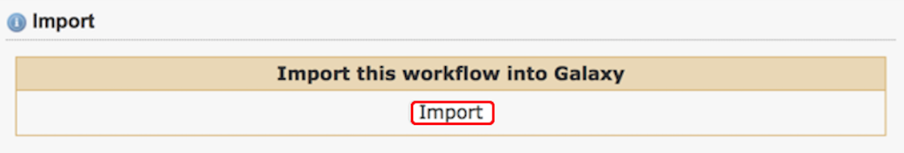

# Import Workflow

Before we can run some data, we need to import the AmrPlusPlus workflow.

Follow the instructions below.

---

## Workflow Installation

??? example "Step 1"
    ### Step 1
    Navigate to the Workflow tab at the top of the Galaxy homepage.

    

??? example "Step 2"
    ### Step 2
    Click on the Upload or import workflow tab at the top right of the page.

    

??? example "Step 3"
    ### Step 3
    Click on the Visit myExperiment link at the bottom of the page.

    

??? example "Step 4"    
    ### Step 4
    Type in amrplusplus into the search box.

    

??? example "Step 5"
    ### Step 5
    You will see two workflows (amrplusplus single-end workflow and amrplusplus paired-end workflow). Click on the amrplusplus paired-end workflow link. You can download the single-end workflow, but we'll be using the paired workflow when we get to the Run Workflow section.

    

    Then, click on the Import button in the middle of the page.

    

??? example "Step 6"
    ### Step 6
    Now, let's [upload some data](../running/upload.md).